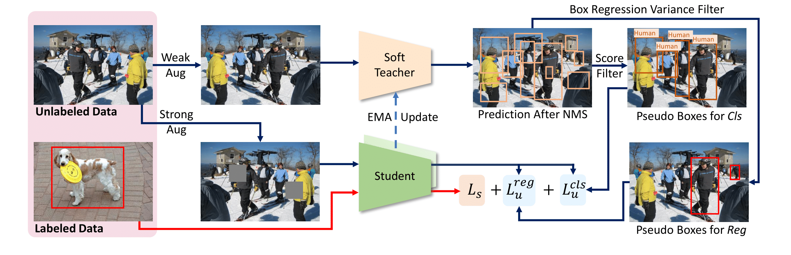

# Important commands
- Follow the coco data installation instructions in the soft teacher repo, then split them to semi-supervised appropriate folders as explained in the repo.
- Run and build docker with proper names, volumes and gpus.
docker build -t deneme:latest .
docker run -it --name cur_soft --shm-size=100gb --gpus '"device=0,1,2,3"' -v /raid/utku/:/workspace -t deneme:latest does the job.
- Run soft teacher only on 2nd fold with 5 percent data only for 20000 iterations for easier testing.
bash tools/dist_train_partially.sh semi 2 5 4 --resume-from work_dirs/soft_teacher_faster_rcnn_r50_caffe_fpn_coco_180k/5/2/iter_8000.pth
- You have to specifically change mmdetection cross entropy loss function as follows:
<<<<<<< HEAD
=======

```
# Copyright (c) OpenMMLab. All rights reserved.
import torch
import torch.nn as nn
import torch.nn.functional as F

from ..builder import LOSSES
from .utils import weight_reduce_loss

iteration = 0
iterations = 6000
focal_loss_powers = torch.linspace(start=-1/2,end=1/2,steps=iterations).cuda()

def cross_entropy(pred,
                  label,
                  weight=None,
                  reduction='mean',
                  avg_factor=None,
                  class_weight=None,
                  ignore_index=-100):
    """Calculate the CrossEntropy loss.

    Args:
        pred (torch.Tensor): The prediction with shape (N, C), C is the number
            of classes.
        label (torch.Tensor): The learning label of the prediction.
        weight (torch.Tensor, optional): Sample-wise loss weight.
        reduction (str, optional): The method used to reduce the loss.
        avg_factor (int, optional): Average factor that is used to average
            the loss. Defaults to None.
        class_weight (list[float], optional): The weight for each class.
        ignore_index (int | None): The label index to be ignored.
            If None, it will be set to default value. Default: -100.

    Returns:
        torch.Tensor: The calculated loss
    """
    global iteration, focal_loss_powers, iterations
    # The default value of ignore_index is the same as F.cross_entropy
    ignore_index = -100 if ignore_index is None else ignore_index
    # element-wise losses
    epsilon = 1e-6 # For numerical stability
    focal_loss_power = focal_loss_powers[int(iteration)]
    if iteration < (iterations -1):
        iteration +=1 # increase by 1
    # print("focal_loss_power: ", focal_loss_power)
    pred_prob_tensor = F.softmax(pred, dim=-1) # choose the prob only belonging to 
    # print("pred_prob_tensor.shape: ", pred_prob_tensor.shape)
    # print("label.shape: ", label.shape)
    pred_prob_array = torch.gather(pred_prob_tensor,dim=-1,index = label.unsqueeze(dim=0))
    # print("pred_prob_array.shape: ", pred_prob_array.shape)
    curriculum_weight = (1-pred_prob_array + epsilon)**focal_loss_power # -1 to focus on easy samples. 1 to focus to hard samples.
    # print("curriculum_weight.shape: ", curriculum_weight.shape)
    cross_entropy_loss = F.cross_entropy(
        pred,
        label,
        weight=class_weight,
        reduction='none',
        ignore_index=ignore_index)
    curriculum_weight.reshape(cross_entropy_loss.shape)
    # print("cross_entropy_loss.shape: ", cross_entropy_loss.shape)
    loss = curriculum_weight*cross_entropy_loss
    # print("loss.shape: ", loss.shape)
    # print("pred_prob_array: ", pred_prob_array)
    # print("curriculum_weight: ", curriculum_weight)

    # apply weights and do the reduction
    if weight is not None:
        weight = weight.float()
    loss = weight_reduce_loss(
        loss, weight=weight, reduction=reduction, avg_factor=avg_factor)

    return loss


def _expand_onehot_labels(labels, label_weights, label_channels, ignore_index):
    """Expand onehot labels to match the size of prediction."""
    bin_labels = labels.new_full((labels.size(0), label_channels), 0)
    valid_mask = (labels >= 0) & (labels != ignore_index)
    inds = torch.nonzero(
        valid_mask & (labels < label_channels), as_tuple=False)

    if inds.numel() > 0:
        bin_labels[inds, labels[inds]] = 1

    valid_mask = valid_mask.view(-1, 1).expand(labels.size(0),
                                               label_channels).float()
    if label_weights is None:
        bin_label_weights = valid_mask
    else:
        bin_label_weights = label_weights.view(-1, 1).repeat(1, label_channels)
        bin_label_weights *= valid_mask

    return bin_labels, bin_label_weights


def binary_cross_entropy(pred,
                         label,
                         weight=None,
                         reduction='mean',
                         avg_factor=None,
                         class_weight=None,
                         ignore_index=-100):
    """Calculate the binary CrossEntropy loss.

    Args:
        pred (torch.Tensor): The prediction with shape (N, 1).
        label (torch.Tensor): The learning label of the prediction.
        weight (torch.Tensor, optional): Sample-wise loss weight.
        reduction (str, optional): The method used to reduce the loss.
            Options are "none", "mean" and "sum".
        avg_factor (int, optional): Average factor that is used to average
            the loss. Defaults to None.
        class_weight (list[float], optional): The weight for each class.
        ignore_index (int | None): The label index to be ignored.
            If None, it will be set to default value. Default: -100.

    Returns:
        torch.Tensor: The calculated loss.
    """
    # The default value of ignore_index is the same as F.cross_entropy
    ignore_index = -100 if ignore_index is None else ignore_index
    if pred.dim() != label.dim():
        label, weight = _expand_onehot_labels(label, weight, pred.size(-1),
                                              ignore_index)

    # weighted element-wise losses
    if weight is not None:
        weight = weight.float()
    loss = F.binary_cross_entropy_with_logits(
        pred, label.float(), pos_weight=class_weight, reduction='none')
    # do the reduction for the weighted loss
    loss = weight_reduce_loss(
        loss, weight, reduction=reduction, avg_factor=avg_factor)

    return loss


def mask_cross_entropy(pred,
                       target,
                       label,
                       reduction='mean',
                       avg_factor=None,
                       class_weight=None,
                       ignore_index=None):
    """Calculate the CrossEntropy loss for masks.

    Args:
        pred (torch.Tensor): The prediction with shape (N, C, *), C is the
            number of classes. The trailing * indicates arbitrary shape.
        target (torch.Tensor): The learning label of the prediction.
        label (torch.Tensor): ``label`` indicates the class label of the mask
            corresponding object. This will be used to select the mask in the
            of the class which the object belongs to when the mask prediction
            if not class-agnostic.
        reduction (str, optional): The method used to reduce the loss.
            Options are "none", "mean" and "sum".
        avg_factor (int, optional): Average factor that is used to average
            the loss. Defaults to None.
        class_weight (list[float], optional): The weight for each class.
        ignore_index (None): Placeholder, to be consistent with other loss.
            Default: None.

    Returns:
        torch.Tensor: The calculated loss

    Example:
        >>> N, C = 3, 11
        >>> H, W = 2, 2
        >>> pred = torch.randn(N, C, H, W) * 1000
        >>> target = torch.rand(N, H, W)
        >>> label = torch.randint(0, C, size=(N,))
        >>> reduction = 'mean'
        >>> avg_factor = None
        >>> class_weights = None
        >>> loss = mask_cross_entropy(pred, target, label, reduction,
        >>>                           avg_factor, class_weights)
        >>> assert loss.shape == (1,)
    """
    assert ignore_index is None, 'BCE loss does not support ignore_index'
    # TODO: handle these two reserved arguments
    assert reduction == 'mean' and avg_factor is None
    num_rois = pred.size()[0]
    inds = torch.arange(0, num_rois, dtype=torch.long, device=pred.device)
    pred_slice = pred[inds, label].squeeze(1)
    return F.binary_cross_entropy_with_logits(
        pred_slice, target, weight=class_weight, reduction='mean')[None]


@LOSSES.register_module()
class CrossEntropyLoss(nn.Module):

    def __init__(self,
                 use_sigmoid=False,
                 use_mask=False,
                 reduction='mean',
                 class_weight=None,
                 ignore_index=None,
                 loss_weight=1.0):
        """CrossEntropyLoss.

        Args:
            use_sigmoid (bool, optional): Whether the prediction uses sigmoid
                of softmax. Defaults to False.
            use_mask (bool, optional): Whether to use mask cross entropy loss.
                Defaults to False.
            reduction (str, optional): . Defaults to 'mean'.
                Options are "none", "mean" and "sum".
            class_weight (list[float], optional): Weight of each class.
                Defaults to None.
            ignore_index (int | None): The label index to be ignored.
                Defaults to None.
            loss_weight (float, optional): Weight of the loss. Defaults to 1.0.
        """
        super(CrossEntropyLoss, self).__init__()
        assert (use_sigmoid is False) or (use_mask is False)
        self.use_sigmoid = use_sigmoid
        self.use_mask = use_mask
        self.reduction = reduction
        self.loss_weight = loss_weight
        self.class_weight = class_weight
        self.ignore_index = ignore_index

        if self.use_sigmoid:
            self.cls_criterion = binary_cross_entropy
        elif self.use_mask:
            self.cls_criterion = mask_cross_entropy
        else:
            self.cls_criterion = cross_entropy

    def forward(self,
                cls_score,
                label,
                weight=None,
                avg_factor=None,
                reduction_override=None,
                ignore_index=None,
                **kwargs):
        """Forward function.

        Args:
            cls_score (torch.Tensor): The prediction.
            label (torch.Tensor): The learning label of the prediction.
            weight (torch.Tensor, optional): Sample-wise loss weight.
            avg_factor (int, optional): Average factor that is used to average
                the loss. Defaults to None.
            reduction_override (str, optional): The method used to reduce the
                loss. Options are "none", "mean" and "sum".
            ignore_index (int | None): The label index to be ignored.
                If not None, it will override the default value. Default: None.
        Returns:
            torch.Tensor: The calculated loss.
        """
        assert reduction_override in (None, 'none', 'mean', 'sum')
        reduction = (
            reduction_override if reduction_override else self.reduction)
        if ignore_index is None:
            ignore_index = self.ignore_index

        if self.class_weight is not None:
            class_weight = cls_score.new_tensor(
                self.class_weight, device=cls_score.device)
        else:
            class_weight = None
        loss_cls = self.loss_weight * self.cls_criterion(
            cls_score,
            label,
            weight,
            class_weight=class_weight,
            reduction=reduction,
            avg_factor=avg_factor,
            ignore_index=ignore_index,
            **kwargs)
        return loss_cls

```


# End-to-End Semi-Supervised Object Detection with Soft Teacher

[](https://paperswithcode.com/sota/semi-supervised-object-detection-on-coco-1?p=end-to-end-semi-supervised-object-detection)
[](https://paperswithcode.com/sota/semi-supervised-object-detection-on-coco-5?p=end-to-end-semi-supervised-object-detection)
[](https://paperswithcode.com/sota/semi-supervised-object-detection-on-coco-10?p=end-to-end-semi-supervised-object-detection)
[](https://paperswithcode.com/sota/semi-supervised-object-detection-on-coco-100?p=end-to-end-semi-supervised-object-detection)
[](https://paperswithcode.com/sota/instance-segmentation-on-coco-minival?p=end-to-end-semi-supervised-object-detection)
[](https://paperswithcode.com/sota/object-detection-on-coco-minival?p=end-to-end-semi-supervised-object-detection)
[](https://paperswithcode.com/sota/instance-segmentation-on-coco?p=end-to-end-semi-supervised-object-detection)
[](https://paperswithcode.com/sota/object-detection-on-coco?p=end-to-end-semi-supervised-object-detection)

By [Mengde Xu*](https://scholar.google.com/citations?user=C04zJHEAAAAJ&hl=zh-CN), [Zheng Zhang*](https://github.com/stupidZZ), [Han Hu](https://github.com/ancientmooner), [Jianfeng Wang](https://github.com/amsword), [Lijuan Wang](https://www.microsoft.com/en-us/research/people/lijuanw/), [Fangyun Wei](https://scholar.google.com.tw/citations?user=-ncz2s8AAAAJ&hl=zh-TW), [Xiang Bai](http://cloud.eic.hust.edu.cn:8071/~xbai/), [Zicheng Liu](https://www.microsoft.com/en-us/research/people/zliu/).


This repo is the official implementation of ICCV2021 paper ["End-to-End Semi-Supervised Object Detection with Soft Teacher"](https://arxiv.org/abs/2106.09018).

## Citation

```bib
@article{xu2021end,
  title={End-to-End Semi-Supervised Object Detection with Soft Teacher},
  author={Xu, Mengde and Zhang, Zheng and Hu, Han and Wang, Jianfeng and Wang, Lijuan and Wei, Fangyun and Bai, Xiang and Liu, Zicheng},
  journal={Proceedings of the IEEE/CVF International Conference on Computer Vision (ICCV)},
  year={2021}
}
```

## Main Results

### Partial Labeled Data

We followed STAC[1] to evaluate on 5 different data splits for each setting, and report the average performance of 5 splits. The results are shown in the following:

#### 1% labeled data
| Method | mAP| Model Weights |Config Files|
| ---- | -------| ----- |----|
| Baseline|  10.0 |-|[Config](configs/baseline/faster_rcnn_r50_caffe_fpn_coco_partial_180k.py)|
| Ours (thr=5e-2)   | 21.62 |[Drive](https://drive.google.com/drive/folders/1QA8sAw49DJiMHF-Cr7q0j7KgKjlJyklV?usp=sharing)|[Config](configs/soft_teacher/soft_teacher_faster_rcnn_r50_caffe_fpn_coco_180k.py)|
| Ours (thr=1e-3)|22.64| [Drive](https://drive.google.com/drive/folders/1QA8sAw49DJiMHF-Cr7q0j7KgKjlJyklV?usp=sharing)|[Config](configs/soft_teacher/soft_teacher_faster_rcnn_r50_caffe_fpn_coco_180k.py)|

#### 5% labeled data
| Method | mAP| Model Weights |Config Files|
| ---- | -------| ----- |----|
| Baseline|  20.92 |-|[Config](configs/baseline/faster_rcnn_r50_caffe_fpn_coco_partial_180k.py)|
| Ours (thr=5e-2)   | 30.42 |[Drive](https://drive.google.com/drive/folders/1FBWj5SB888m0LU_XYUOK9QEgiubSbU-8?usp=sharing)|[Config](configs/soft_teacher/soft_teacher_faster_rcnn_r50_caffe_fpn_coco_180k.py)|
| Ours (thr=1e-3)|31.7| [Drive](https://drive.google.com/drive/folders/1FBWj5SB888m0LU_XYUOK9QEgiubSbU-8?usp=sharing)|[Config](configs/soft_teacher/soft_teacher_faster_rcnn_r50_caffe_fpn_coco_180k.py)|

#### 10% labeled data
| Method | mAP| Model Weights |Config Files|
| ---- | -------| ----- |----|
| Baseline|  26.94 |-|[Config](configs/baseline/faster_rcnn_r50_caffe_fpn_coco_partial_180k.py)|
| Ours (thr=5e-2)   | 33.78 |[Drive](https://drive.google.com/drive/folders/1WyAVpfnWxEgvxCLUesxzNB81fM_de9DI?usp=sharing)|[Config](configs/soft_teacher/soft_teacher_faster_rcnn_r50_caffe_fpn_coco_180k.py)|
| Ours (thr=1e-3)|34.7| [Drive](https://drive.google.com/drive/folders/1WyAVpfnWxEgvxCLUesxzNB81fM_de9DI?usp=sharing)|[Config](configs/soft_teacher/soft_teacher_faster_rcnn_r50_caffe_fpn_coco_180k.py)|

### Full Labeled Data

#### Faster R-CNN (ResNet-50)
| Model | mAP| Model Weights |Config Files|
| ------ |--- | ----- |----|
| Baseline |  40.9 | - | [Config](configs/baseline/faster_rcnn_r50_caffe_fpn_coco_full_720k.py) |
| Ours (thr=5e-2) | 44.05 |[Drive](https://drive.google.com/file/d/1QSwAcU1dpmqVkJiXufW_QaQu-puOeblG/view?usp=sharing)|[Config](configs/soft_teacher/soft_teacher_faster_rcnn_r50_caffe_fpn_coco_full_720k.py)|
| Ours (thr=1e-3) | 44.6 |[Drive](https://drive.google.com/file/d/1QSwAcU1dpmqVkJiXufW_QaQu-puOeblG/view?usp=sharing)|[Config](configs/soft_teacher/soft_teacher_faster_rcnn_r50_caffe_fpn_coco_full_720k.py)|
| Ours* (thr=5e-2) | 44.5 | - | [Config](configs/soft_teacher/soft_teacher_faster_rcnn_r50_caffe_fpn_coco_full_1440k.py) |
| Ours* (thr=1e-3) |  44.9 | - | [Config](configs/soft_teacher/soft_teacher_faster_rcnn_r50_caffe_fpn_coco_full_1440k.py) |

####  Faster R-CNN (ResNet-101)
| Model | mAP| Model Weights |Config Files|
| ------ |--- | ----- |----|
| Baseline |  43.8 | -   | [Config](configs/baseline/faster_rcnn_r101_caffe_fpn_coco_full_720k.py) |
| Ours* (thr=5e-2) |  46.9 | [Drive](https://drive.google.com/file/d/1LCZpIKBt0ihnPmvvZolV-L94uIn-U7Sp/view?usp=sharing) |[Config](configs/soft_teacher/soft_teacher_faster_rcnn_r101_caffe_fpn_coco_full_1080k.py) |
| Ours* (thr=1e-3) |  47.6 | [Drive](https://drive.google.com/file/d/1LCZpIKBt0ihnPmvvZolV-L94uIn-U7Sp/view?usp=sharing) | [Config](configs/soft_teacher/soft_teacher_faster_rcnn_r101_caffe_fpn_coco_full_1080k.py) |


### Notes
- Ours* means we use longer training schedule.
- `thr` indicates `model.test_cfg.rcnn.score_thr` in config files. This inference trick was first introduced by Instant-Teaching[2].
- All models are trained on 8*V100 GPUs

## Usage

### Requirements
- `Ubuntu 16.04`
- `Anaconda3` with `python=3.6`
- `Pytorch=1.9.0`
- `mmdetection=2.16.0+fe46ffe`
- `mmcv=1.3.9`
- `wandb=0.10.31`

#### Notes
- We use [wandb](https://wandb.ai/) for visualization, if you don't want to use it, just comment line `273-284` in `configs/soft_teacher/base.py`.
- The project should be compatible to the latest version of `mmdetection`. If you want to switch to the same version `mmdetection` as ours, run `cd thirdparty/mmdetection && git checkout v2.16.0`
### Installation
```
make install
```

### Data Preparation
- Download the COCO dataset
- Execute the following command to generate data set splits:
```shell script
# YOUR_DATA should be a directory contains coco dataset.
# For eg.:
# YOUR_DATA/
#  coco/
#     train2017/
#     val2017/
#     unlabeled2017/
#     annotations/
ln -s ${YOUR_DATA} data
bash tools/dataset/prepare_coco_data.sh conduct

```
For concrete instructions of what should be downloaded, please refer to `tools/dataset/prepare_coco_data.sh` line [`11-24`](https://github.com/microsoft/SoftTeacher/blob/863d90a3aa98615be3d156e7d305a22c2a5075f5/tools/dataset/prepare_coco_data.sh#L11)
### Training
- To train model on the **partial labeled data** setting:
```shell script
# JOB_TYPE: 'baseline' or 'semi', decide which kind of job to run
# PERCENT_LABELED_DATA: 1, 5, 10. The ratio of labeled coco data in whole training dataset.
# GPU_NUM: number of gpus to run the job
for FOLD in 1 2 3 4 5;
do
  bash tools/dist_train_partially.sh <JOB_TYPE> ${FOLD} <PERCENT_LABELED_DATA> <GPU_NUM>
done
```
For example, we could run the following scripts to train our model on 10% labeled data with 8 GPUs:

```shell script
for FOLD in 1 2 3 4 5;
do
  bash tools/dist_train_partially.sh semi ${FOLD} 10 8
done
```

- To train model on the **full labeled data** setting:

```shell script
bash tools/dist_train.sh <CONFIG_FILE_PATH> <NUM_GPUS>
```
For example, to train ours `R50` model with 8 GPUs:
```shell script
bash tools/dist_train.sh configs/soft_teacher/soft_teacher_faster_rcnn_r50_caffe_fpn_coco_full_720k.py 8
```
- To train model on **new dataset**:

The core idea is to convert a new dataset to coco format. Details about it can be found in the [adding new dataset](https://github.com/open-mmlab/mmdetection/blob/master/docs/tutorials/customize_dataset.md).
>>>>>>> 086cae9182b6630993c4027dda6567b0ff5ff095

```
# Copyright (c) OpenMMLab. All rights reserved.
import torch
import torch.nn as nn
import torch.nn.functional as F

from ..builder import LOSSES
from .utils import weight_reduce_loss

iteration = 0
iterations = 6000
focal_loss_powers = torch.linspace(start=-1/2,end=1/2,steps=iterations).cuda()

def cross_entropy(pred,
                  label,
                  weight=None,
                  reduction='mean',
                  avg_factor=None,
                  class_weight=None,
                  ignore_index=-100):
    """Calculate the CrossEntropy loss.

    Args:
        pred (torch.Tensor): The prediction with shape (N, C), C is the number
            of classes.
        label (torch.Tensor): The learning label of the prediction.
        weight (torch.Tensor, optional): Sample-wise loss weight.
        reduction (str, optional): The method used to reduce the loss.
        avg_factor (int, optional): Average factor that is used to average
            the loss. Defaults to None.
        class_weight (list[float], optional): The weight for each class.
        ignore_index (int | None): The label index to be ignored.
            If None, it will be set to default value. Default: -100.

    Returns:
        torch.Tensor: The calculated loss
    """
    global iteration, focal_loss_powers, iterations
    # The default value of ignore_index is the same as F.cross_entropy
    ignore_index = -100 if ignore_index is None else ignore_index
    # element-wise losses
    epsilon = 1e-6 # For numerical stability
    focal_loss_power = focal_loss_powers[int(iteration)]
    if iteration < (iterations -1):
        iteration +=1 # increase by 1
    # print("focal_loss_power: ", focal_loss_power)
    pred_prob_tensor = F.softmax(pred, dim=-1) # choose the prob only belonging to 
    # print("pred_prob_tensor.shape: ", pred_prob_tensor.shape)
    # print("label.shape: ", label.shape)
    pred_prob_array = torch.gather(pred_prob_tensor,dim=-1,index = label.unsqueeze(dim=0))
    # print("pred_prob_array.shape: ", pred_prob_array.shape)
    curriculum_weight = (1-pred_prob_array + epsilon)**focal_loss_power # -1 to focus on easy samples. 1 to focus to hard samples.
    # print("curriculum_weight.shape: ", curriculum_weight.shape)
    cross_entropy_loss = F.cross_entropy(
        pred,
        label,
        weight=class_weight,
        reduction='none',
        ignore_index=ignore_index)
    curriculum_weight.reshape(cross_entropy_loss.shape)
    # print("cross_entropy_loss.shape: ", cross_entropy_loss.shape)
    loss = curriculum_weight*cross_entropy_loss
    # print("loss.shape: ", loss.shape)
    # print("pred_prob_array: ", pred_prob_array)
    # print("curriculum_weight: ", curriculum_weight)

    # apply weights and do the reduction
    if weight is not None:
        weight = weight.float()
    loss = weight_reduce_loss(
        loss, weight=weight, reduction=reduction, avg_factor=avg_factor)

    return loss


def _expand_onehot_labels(labels, label_weights, label_channels, ignore_index):
    """Expand onehot labels to match the size of prediction."""
    bin_labels = labels.new_full((labels.size(0), label_channels), 0)
    valid_mask = (labels >= 0) & (labels != ignore_index)
    inds = torch.nonzero(
        valid_mask & (labels < label_channels), as_tuple=False)

    if inds.numel() > 0:
        bin_labels[inds, labels[inds]] = 1

    valid_mask = valid_mask.view(-1, 1).expand(labels.size(0),
                                               label_channels).float()
    if label_weights is None:
        bin_label_weights = valid_mask
    else:
        bin_label_weights = label_weights.view(-1, 1).repeat(1, label_channels)
        bin_label_weights *= valid_mask

    return bin_labels, bin_label_weights


def binary_cross_entropy(pred,
                         label,
                         weight=None,
                         reduction='mean',
                         avg_factor=None,
                         class_weight=None,
                         ignore_index=-100):
    """Calculate the binary CrossEntropy loss.

    Args:
        pred (torch.Tensor): The prediction with shape (N, 1).
        label (torch.Tensor): The learning label of the prediction.
        weight (torch.Tensor, optional): Sample-wise loss weight.
        reduction (str, optional): The method used to reduce the loss.
            Options are "none", "mean" and "sum".
        avg_factor (int, optional): Average factor that is used to average
            the loss. Defaults to None.
        class_weight (list[float], optional): The weight for each class.
        ignore_index (int | None): The label index to be ignored.
            If None, it will be set to default value. Default: -100.

    Returns:
        torch.Tensor: The calculated loss.
    """
    # The default value of ignore_index is the same as F.cross_entropy
    ignore_index = -100 if ignore_index is None else ignore_index
    if pred.dim() != label.dim():
        label, weight = _expand_onehot_labels(label, weight, pred.size(-1),
                                              ignore_index)

    # weighted element-wise losses
    if weight is not None:
        weight = weight.float()
    loss = F.binary_cross_entropy_with_logits(
        pred, label.float(), pos_weight=class_weight, reduction='none')
    # do the reduction for the weighted loss
    loss = weight_reduce_loss(
        loss, weight, reduction=reduction, avg_factor=avg_factor)

    return loss


def mask_cross_entropy(pred,
                       target,
                       label,
                       reduction='mean',
                       avg_factor=None,
                       class_weight=None,
                       ignore_index=None):
    """Calculate the CrossEntropy loss for masks.

    Args:
        pred (torch.Tensor): The prediction with shape (N, C, *), C is the
            number of classes. The trailing * indicates arbitrary shape.
        target (torch.Tensor): The learning label of the prediction.
        label (torch.Tensor): ``label`` indicates the class label of the mask
            corresponding object. This will be used to select the mask in the
            of the class which the object belongs to when the mask prediction
            if not class-agnostic.
        reduction (str, optional): The method used to reduce the loss.
            Options are "none", "mean" and "sum".
        avg_factor (int, optional): Average factor that is used to average
            the loss. Defaults to None.
        class_weight (list[float], optional): The weight for each class.
        ignore_index (None): Placeholder, to be consistent with other loss.
            Default: None.

    Returns:
        torch.Tensor: The calculated loss

    Example:
        >>> N, C = 3, 11
        >>> H, W = 2, 2
        >>> pred = torch.randn(N, C, H, W) * 1000
        >>> target = torch.rand(N, H, W)
        >>> label = torch.randint(0, C, size=(N,))
        >>> reduction = 'mean'
        >>> avg_factor = None
        >>> class_weights = None
        >>> loss = mask_cross_entropy(pred, target, label, reduction,
        >>>                           avg_factor, class_weights)
        >>> assert loss.shape == (1,)
    """
    assert ignore_index is None, 'BCE loss does not support ignore_index'
    # TODO: handle these two reserved arguments
    assert reduction == 'mean' and avg_factor is None
    num_rois = pred.size()[0]
    inds = torch.arange(0, num_rois, dtype=torch.long, device=pred.device)
    pred_slice = pred[inds, label].squeeze(1)
    return F.binary_cross_entropy_with_logits(
        pred_slice, target, weight=class_weight, reduction='mean')[None]


@LOSSES.register_module()
class CrossEntropyLoss(nn.Module):

    def __init__(self,
                 use_sigmoid=False,
                 use_mask=False,
                 reduction='mean',
                 class_weight=None,
                 ignore_index=None,
                 loss_weight=1.0):
        """CrossEntropyLoss.

        Args:
            use_sigmoid (bool, optional): Whether the prediction uses sigmoid
                of softmax. Defaults to False.
            use_mask (bool, optional): Whether to use mask cross entropy loss.
                Defaults to False.
            reduction (str, optional): . Defaults to 'mean'.
                Options are "none", "mean" and "sum".
            class_weight (list[float], optional): Weight of each class.
                Defaults to None.
            ignore_index (int | None): The label index to be ignored.
                Defaults to None.
            loss_weight (float, optional): Weight of the loss. Defaults to 1.0.
        """
        super(CrossEntropyLoss, self).__init__()
        assert (use_sigmoid is False) or (use_mask is False)
        self.use_sigmoid = use_sigmoid
        self.use_mask = use_mask
        self.reduction = reduction
        self.loss_weight = loss_weight
        self.class_weight = class_weight
        self.ignore_index = ignore_index

        if self.use_sigmoid:
            self.cls_criterion = binary_cross_entropy
        elif self.use_mask:
            self.cls_criterion = mask_cross_entropy
        else:
            self.cls_criterion = cross_entropy

    def forward(self,
                cls_score,
                label,
                weight=None,
                avg_factor=None,
                reduction_override=None,
                ignore_index=None,
                **kwargs):
        """Forward function.

        Args:
            cls_score (torch.Tensor): The prediction.
            label (torch.Tensor): The learning label of the prediction.
            weight (torch.Tensor, optional): Sample-wise loss weight.
            avg_factor (int, optional): Average factor that is used to average
                the loss. Defaults to None.
            reduction_override (str, optional): The method used to reduce the
                loss. Options are "none", "mean" and "sum".
            ignore_index (int | None): The label index to be ignored.
                If not None, it will override the default value. Default: None.
        Returns:
            torch.Tensor: The calculated loss.
        """
        assert reduction_override in (None, 'none', 'mean', 'sum')
        reduction = (
            reduction_override if reduction_override else self.reduction)
        if ignore_index is None:
            ignore_index = self.ignore_index

        if self.class_weight is not None:
            class_weight = cls_score.new_tensor(
                self.class_weight, device=cls_score.device)
        else:
            class_weight = None
        loss_cls = self.loss_weight * self.cls_criterion(
            cls_score,
            label,
            weight,
            class_weight=class_weight,
            reduction=reduction,
            avg_factor=avg_factor,
            ignore_index=ignore_index,
            **kwargs)
        return loss_cls

```